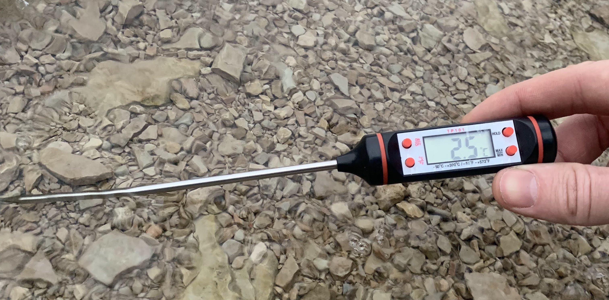
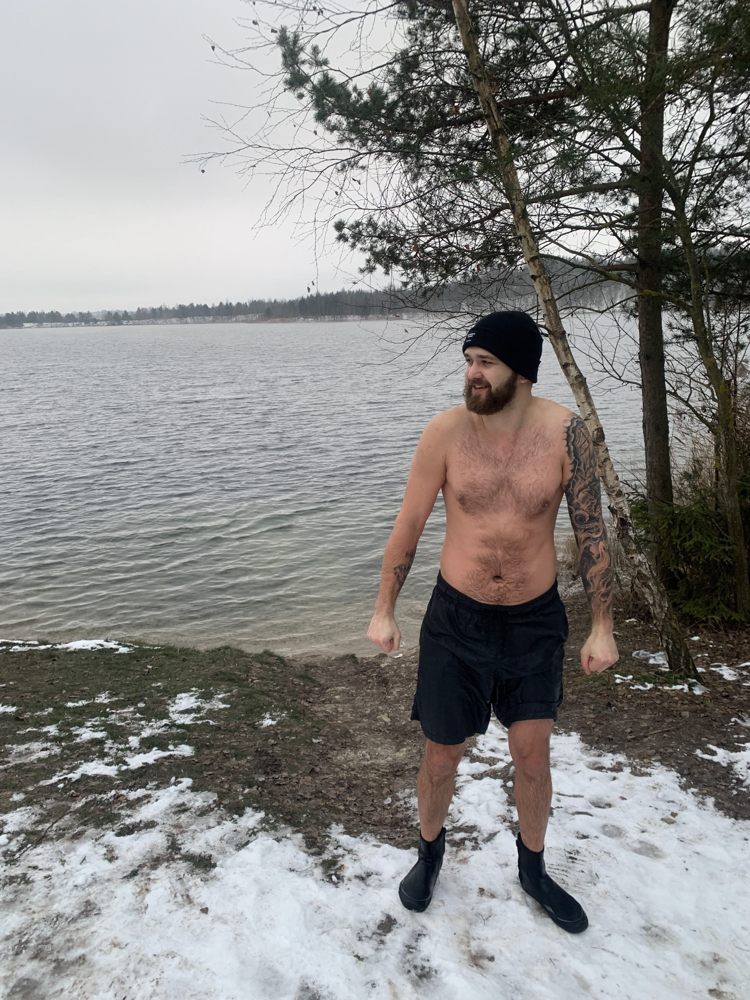

# Swimming in the winter
<small><em>Published on 03.12.2022</em></small>

December 3rd 2022 I went swimming during winter for the first time in my life.

For me this was a new milestone in mental resilience and ability to deal with pain.

The sensation of being in a 2.5C water is a slow burning of your skin. It took me 2 minutes before I decided not to continue further because it was my first time.

Something in me said that I shouldn't overdo it for the first time. Don't get me wrong, it was hard to stay in the water but my point wasn't to prove how long I can sit. This is a long-term journey. No need to rush.

You can read about the benefits of cold water exposure online and decide for yourself if that's something you would like to experience.

I will list some tips I learned from others in case you decide to start winter swimming:

- **Wear a hat, gloves and diving socks or boots.** 
<small>These items really help with making the experience much more tolerable with no difference in effects.</small>

- **Do it with someone** 
<small>Having others go through the same experience allows everyone to support each other. Additionally, you increase safety in case something goes wrong</small>

- **Start with cold showers** 
<small>Depends on your living environment, but typically you will have a shower with hot water. Everytime you shower, try to reduce the temperature a bit.</small>

- **Do it in the morning** 
<small>Depending on what information you believe, cold water exposure releases adrenaline, noradrenaline and facilitates a slow release of dopamine for a few hours. This is not something you want before going to sleep. I learned of this from [Dr. Andrew Hubermans podcast](https://www.youtube.com/watch?v=QmOF0crdyRU)</small>

Here's an extreme cold exposure enthusiast in case you're interested 😅 - [Wim Hof](https://www.youtube.com/watch?v=VF8dkjEdKNo)

Thank you
